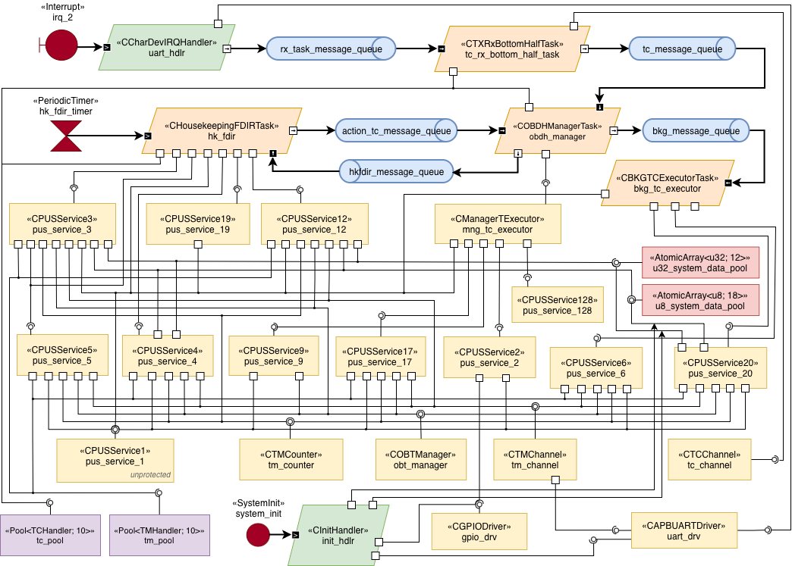

# OBDH-ASW-Termina

This repository contains the source code of an on-board data handling (OBDH) application for a satellite, written in the Termina programming language. The application implements a representative subset of the functionality expected from an OBDH system: receiving telecommands from the ground, generating and transmitting telemetry, monitoring system parameters, and executing corrective actions when anomalies are detected. Command and telemetry packets follow the protocol defined by the Consultative Committee for Space Data Systems (CCSDS), and the application implements a set of services in accordance with the ECSS Packet Utilization Standard (PUS).

The application has been validated on a LEON3 processor synthesized on a Nexys A7 FPGA development board, running the RTEMS real-time operating system.

## Architecture



The system comprises 4 tasks, 2 interrupt handlers, 23 resources, 1 periodic timer emitter, and 5 message queue channels. Communication with the external environment takes place via a UART serial interface: the `uart_hdlr` interrupt handler receives telecommand frames, and the `tm_channel` resource manages telemetry transmission.

The active entities that define the system's behavior are the following:

- `hk_fdir`: periodically triggered by `hk_fdir_timer` (1 s period), collects housekeeping telemetry and performs FDIR monitoring. When a recovery action is pending, it extracts and routes it for execution.
- `obdh_manager`: receives telecommands from `tc_rx_bottom_half_task` and classifies them by execution category. Housekeeping/FDIR commands are forwarded to `hk_fdir`; background commands to `bkg_tc_executor`; priority commands are executed inline via `mng_tc_executor`.
- `tc_rx_bottom_half_task`: assembles telecommand frames from the byte stream provided by the UART interrupt handler and forwards complete telecommands to `obdh_manager`.
- `bkg_tc_executor`: executes background telecommands (parameter management, memory access).

These tasks interact with a set of PUS service resources that implement the application's functional capabilities:

| Resource | PUS Service | Function |
|----------|-------------|----------|
| `pus_service_1` | TC Verification (ST[01]) | Acceptance and execution verification reports |
| `pus_service_2` | Device Access (ST[02]) | GPIO device control |
| `pus_service_3` | Housekeeping (ST[03]) | Periodic HK data collection and reporting |
| `pus_service_4` | Statistics (ST[04]) | Parameter statistics (min, max, mean) |
| `pus_service_5` | Event Reporting (ST[05]) | Event detection and TM generation |
| `pus_service_6` | Memory Management (ST[06]) | On-board memory read/write access |
| `pus_service_9` | Time Management (ST[09]) | On-board time correlation |
| `pus_service_12` | Parameter Monitoring (ST[12]) | Limit checking on system parameters |
| `pus_service_17` | Test (ST[17]) | Connection (alive) test |
| `pus_service_19` | Event-Action (ST[19]) | Autonomous recovery action management |
| `pus_service_20` | Parameter Management (ST[20]) | System data pool read/write |
| `pus_service_128` | Reboot (vendor-specific) | System reboot command |

System parameters are stored in two atomic arrays (`u32_system_data_pool` and `u8_system_data_pool`) that serve as the centralized system data pool. Additional resources handle telemetry formatting and transmission (`tm_channel`, `tm_counter`, `obt_manager`), telecommand byte-level reception (`tc_channel`, `uart_drv`), and GPIO access (`gpio_drv`).

## Real-Time Situation Specifications

The `rts/` directory contains six real-time situation specifications of increasing complexity, used for schedulability analysis:

| Scenario | Description |
|----------|-------------|
| S1 (`s1-hk-fdir.rt`) | Baseline: single periodic HK/FDIR transaction |
| S2 (`s2-hk-fdir-recovery.rt`) | Full FDIR recovery path (5-step single transaction) |
| S3 (`s3-hk-fdir-tc-hkfdir.rt`) | HK/FDIR + TC reception routed to `hk_fdir` |
| S4 (`s4-hk-fdir-tc-bkg.rt`) | HK/FDIR + TC reception routed to `bkg_tc_executor` |
| S5 (`s5-full.rt`) | Full operational mode with three-way TC routing |
| S6 (`s6-overload.rt`) | Overload scenario (unschedulable by design) |

Each scenario specifies the transaction structure, event sources, activation patterns, and end-to-end deadlines. The Termina transpiler uses these specifications, together with the WCET data in `efp/`, to derive schedulability analysis models.

## Repository Structure

```
app/                    Application deployment (app.fin)
src/                    Termina source code
  handlers/             Interrupt and initialization handlers
  tasks/                Task class definitions
  resources/            Resource class definitions
  service_libraries/    PUS services, CCSDS encoding, and auxiliary modules
efp/                    Execution flow profiles
  drivers/              WCET and path data for device drivers
  handlers/             WCET and path data for handlers
  tasks/                WCET and path data for tasks
  resources/            WCET and path data for resources
  service_libraries/    WCET and path data for PUS services
rts/                    Real-time situation specifications (S1-S6)
output/                 Generated C code (produced by the Termina transpiler)
termina.yaml            Transpilation and platform configuration
```

## Target Platform

- **Processor**: LEON3 (synthesized on Nexys A7 FPGA)
- **RTOS**: RTEMS 5
- **Build system**: Make (generated by the transpiler)
