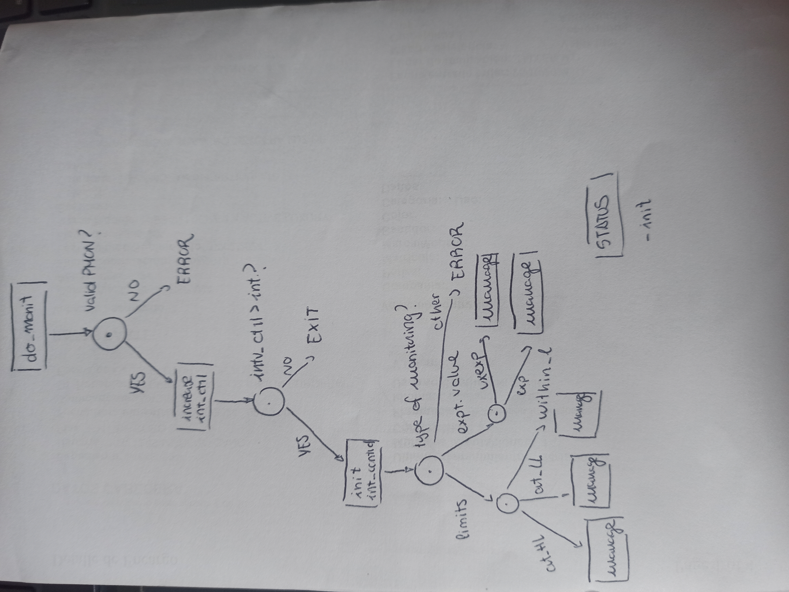

# Siguiendo las recomendaciones de Óscar

## Cambio en el paradigma de programación - PS12



```
procedure do_monitoring (&mut self, PMONID: u16, … ) {
    for i = 0 in 5 while status !Exit{
        match status {
            case Init=> {
                self->init_do_monitoring(); //method
            }
            case check_PMONID => {
                self->is_valid_PMONID(); //viewer
            }
            case valid_PMONID => {
                self->manage_interval_control(); 
            //method >> PMON as ID resource field
            }
            case init_monitoring => {
                self->which_type_of_monitoring(); //viewer
            } 
            case do_limits_monitoring =>{
                self->PID_status(); //method
                match limits_monitoring_status =>{
                    case out_of_high_limit(){
                        fault_info = self->manage_out_of_hl_state(); //method
                    }
                    case out_of_low_limit(){

                        fault_info = self->manage_out_of_ll_state(); //method

                    }
                    case within_limits() {

                        fault_info = self->manage_within_limits(); //method
                    }

                }
                    
            }
            case do_expected_value_montoring => {

                self->PID_status(); //method
                match exp_value_monitoring_status =>{
                    case unexpected{
                        fault_info = self->manage_unexpected(); //method
                    }
                    case expected{

                        fault_info = self->expected(); //method

                    }
                    

                }
            }
        }
    }
}
```
