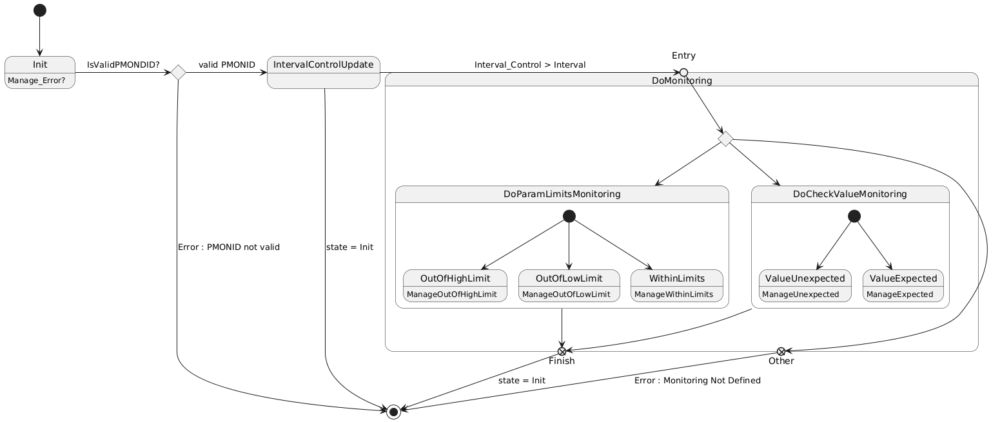

# Siguiendo las recomendaciones de Óscar

## Cambio en el paradigma de programación - PS12



```
struct RequestStatusUpdate {
    PMONID: u16;
    EvID: u16;
    current_monitor_definition: MonitorDefinition;
    fault_info: FaultInfo;
    new_status: CheckState;
    event_triggered: bool;
}

enum DoMonitoringReqStatus {
    Init;
    CheckPMONID;
    GetMonitoringType;
    DoLimitsMonitoring;
    DoExpectedValueMonitoring;
    GetRequestStatusUpdate;
    Exit;
}


```


```
viewer is_valid_PMONID(&self) -> bool{

    var is_valid : bool = false;

    if (self->req_status_update.PMONID < max_num_pmon_ids) {

        is_valid = true;
    }

    return is_valid;
}

viewer is_limits_monitoring(&self) -> bool{

    let current_PMON_ID : usize = (self->req_status_update.PMONID) as usize; 
    var is_limits_mon : bool = false;

    if (self->param_mon_config_table[current_PMON_ID].type is Limits){

        is_limits_mon = true;
    }

    return is_limits_mon;
}


viewer is_expected_value_monitoring(&self) -> bool{

    let current_PMON_ID : usize = (self->req_status_update.PMONID) as usize; 
    var is_exp_val_mon : bool = false;

    if (self->param_mon_config_table[current_PMON_ID].type is ExpectedValue){

        is_exp_val_mon = true;
    }

    return is_exp_val_mon;
}

viewer get_limits_monitoring_defintion(&self) -> ParamLimitCheckDefinition {

    let current_PMON_ID : usize = (self->req_status_update.PMONID) as usize; 
    var monitoring_definition : ParamLimitheckDefinition {
        low_limit = 0;
        low_limit_evID = 0;
        high_limit = 0;
        high_limit_evID = 0;
    }

    match(self->param_mon_config_table[current_PMON_ID].definition) {

        case ParamValueCheck(param_check_defintion)=> {
            //error
        }
        case ParamLimitCheck(limit_check_def)=> {

            monitoring_definition = limit_check_def;
        }
        
        case ParamDeltaCheck(delta_check_definition) => {
            //error
        }
        case Unselected => {
            //error
        }
    }

    return monitoring_definition;
}


viewer get_expected_value_monitoring_definition(&self) -> ParamValueCheckDefinition {

    let current_PMON_ID : usize = (self->req_status_update.PMONID) as usize; 
    var monitoring_definition : ParamValueCheckDefinition {
        mask_value = 0;
        expected_value = 0;
        EvID = 0;
    }

    match(self->param_mon_config_table[current_PMON_ID].definition) {

        case ParamValueCheck(param_check_defintion)=> {

            monitoring_definition = param_check_definition;
            
        }
        case ParamLimitCheck(limit_check_def)=> {

        }
        
        case ParamDeltaCheck(delta_check_definition) => {
            
        }
        case Unselected => {
            
        }
    }

    return monitoring_definition;
}

method manage_interval_control(&priv self)->DoMonitoringReqStatus{

    let current_PMON_ID : usize = (self->req_status_update.PMONID) as usize; 
    var next_status : DoMonitoringReqStatus = DoMonitoringReqStatus::Exit;

    self->param_mon_config_table[current_PMON_ID].interval_control = self->param_mon_config_table[current_PMON_ID].interval_control + 1;

    if(self->param_mon_config_table[current_PMON_ID].interval_control >= self->param_mon_config_table[current_PMON_ID].interval){

        self->param_mon_config_table[PMONID as usize].interval_control = 0;
        next_status = DoMonitoringReqStatus::DoMonitoring;

    } else {

        next_status = DoMonitoringReqStatus::Exit;
    }

    return next_status;
}

viewer check_PID_status_limits_monitoring(&priv self)-> CheckLimitsStatus{

    var current_monitor_definition : ParamLimitCheckDefinition = self->get_limits_monitoring_definition();
    var check_status: CheckLimitsStatus = CheckLimitsStatus::MonitorUnchecked;

    if(self->PID_is_above_upper_limit(&current_monitor_definition)){

        check_status = CheckLimitsStatus::MonitorAboveUpperLimit;

    }
    else if(self->PID_is_below_lower_limit(&current_monitor_definiton)){

        check_status = CheckLimitsStatus::MonitorBelowLowerLimit;

    }
    else {

        //monitor within limits
        check_status = CheckLimitsStatus::MonitorWithinLimits;
    }

    return check_status;

}

viewer check_PID_status_exp_val_monitoring(&priv self)-> CheckValueStatus {

    var current_monitor_definition : ParamValueCheckDefinition = self->get_expected_value_monitoring_definition();
    var check_status : CheckValueStatus = CheckValueStatus::MonitorUnchecked;

    if(self->PID_has_expected_masked_value(&current_monitor_definition)){

        check_status = CheckValueStatus::MonitorValueExpected;

    }
    else {

        check_status = CheckValueStatus::MonitorValueUnexpected;

    }

    return check_status;
}


```


```
procedure do_monitoring (&mut self, PMONID: u16, evID : &mut u16, fault_info : &mut FaultInfo, event_triggered: &mut bool) {

    for i = 0 in 4 while (self->req_status is Exit == false){
        match self->req_status {
            case Init=> {

                self->req_status_update.PMONID = PMONID;
                self->req_status_update.evID = *evID;
                self->req_status_update.fault_info = *fault_info;
                self->req_status = DoMonitoringReqStatus::checkPMONID;
                self->req_status_update.event_triggered = false;

            }
            case checkPMONID => {

                //choice point
                if (self->is_valid_PMONID()) {
                    self->req_status = self->manage_interval_control(); //method 
                } else {
                    self->req_status = DoMonitoringReqStatus::Exit;
                }
            }
            
            case GetMonitoringType => {

                if(self->param_mon_config_table[PMONID as usize].enabled == true){

                    //choice point
                    if(self->is_limits_monitoring) {

                        self->req_status = DoMonitoringReqStatus::DoLimitsMonitoring;
                        

                    } else if (self->is_expected_value_monitoring) {

                        self->req_status = DoMonitoringReqStatus::DoExpectedValueMonitoring;

                    }
                    else {
                        self->req_status = DoMonitoringReqStatus::Exit;
                    }

                } else {

                    self->req_status = DoMonitoringReqStatus::Exit;
                }
               
            } 
            case DoLimitsMonitoring =>{

                var limits_monitoring_status : CheckLimitsStatus = self->check_PID_status_limits_monitoring(); 

                match limits_monitoring_status =>{
                    case MonitorAboveHighLimit {

                        self->req_status = self->manage_param_above_upper_limit(); //method
                    }
                    case MonitorBelowLowLimit {

                        self->req_status = self->manage_param_below_lower_limit(); //method

                    }
                    case MonitorWithinLimits {

                        self->req_status = self->manage_param_within_limits(); //method
                    }
                    case MonitorUnchecked {

                    }

                }
                    
            }
            case DoExpectedValueMonitoring => {

                var exp_value_monitoring_status: CheckValueStatus = self->check_PID_status_exp_val_monitoring(); //viewer

                match exp_value_monitoring_status =>{
                    case unexpected{
                        self->req_status = self->manage_unexpected_value(); //method
                    }
                    case expected{

                        self->req_status = self->manage_expected_value(); //method

                    }
                    

                }
            }
            case GetRequestStatusUpdate => {
                *evID = self->req_status_update.evID;
                *fault_info = self->req_status_update.fault_info;
            }
        }
    }

    if(self->req_status is DoMonitoringReqStatus::Exit){

        self->req_status = DoMonitoringReqStatus::Init;
    }

    return;
}
```
